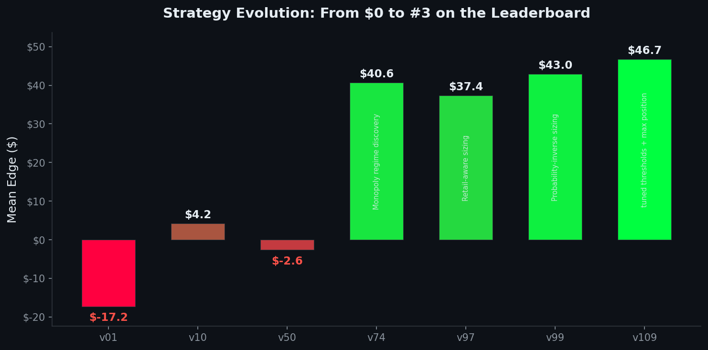
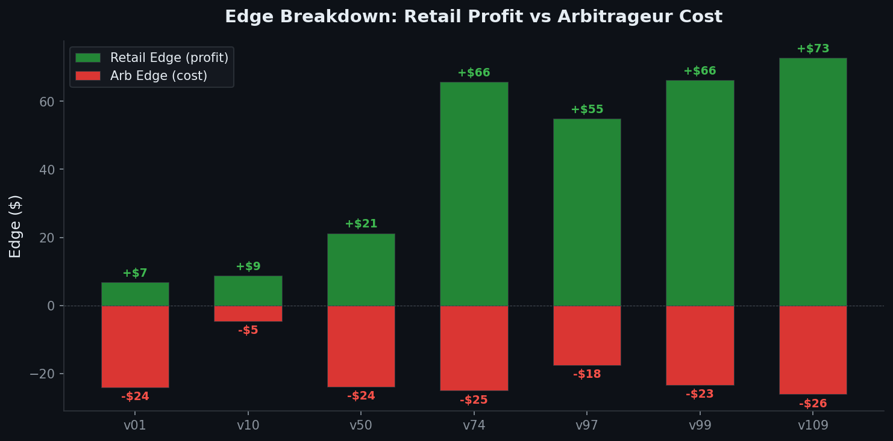

<p align="center">
  
</p>

<p align="center">
  <strong>A market-making strategy that placed #3 in Paradigm's Prediction Market Challenge</strong>
  <br>
  <em>110 strategy iterations. 8 hours. Built with <a href="https://claude.ai/claude-code">Claude Code</a>.</em>
</p>

<p align="center">
  <a href="#the-strategy">Strategy</a> &bull;
  <a href="#key-discoveries">Discoveries</a> &bull;
  <a href="#what-failed">Failures</a> &bull;
  <a href="#quickstart">Run It</a> &bull;
  <a href="#strategy-evolution">Evolution</a>
</p>

---

## Results

| Metric | Value |
|--------|-------|
| **Final Placement** | #3 out of all submissions |
| **Platform Score** | ~$54 mean edge per simulation |
| **Local Score (200 sims)** | $46.70 mean edge |
| **Strategy Iterations** | 110 versions |
| **Development Time** | 8 hours |
| **Edge Source** | ~60% monopoly regime, ~40% normal regime |



## What You'll Learn

This repo is a complete case study in **automated market making for prediction markets**. If you're interested in Polymarket, Kalshi, or prediction market microstructure, this is for you.

- **How market makers actually profit** — capturing the spread between retail flow and true probability
- **The monopoly regime** — the single insight worth more than 100 parameter tweaks
- **Why sizing matters more than you think** — and how to match retail order flow
- **Volatility-adjusted quote filtering** — avoiding the omniscient arbitrageur
- **Inventory management** — how skew prevents catastrophic losses (removing it = -$7 swing)

## The Challenge

[Paradigm's Automated Research Hackathon](https://www.optimizationarena.com/hackathon) (April 9, 2026) challenged participants to build a market-making strategy for a simulated binary prediction market.

**The setup:**
- A binary YES/NO contract that settles to $1 or $0
- A FIFO limit order book with integer tick prices (1-99 cents)
- Your strategy can only place **passive** (limit) orders

**The agents:**
- **You** — passive market maker, trying to maximize edge
- **Competitor** — static hidden ladder, always present, replenishes after fills
- **Arbitrageur** — knows the true probability, sweeps ALL mispriced orders before retail sees them
- **Retail** — uninformed traders, Poisson arrival (~0.25/step), LogNormal sizing (~$4.5 mean)

**Scoring** is based on **edge**, not P&L:
```
Buy edge  = quantity x (true_probability - fill_price)
Sell edge = quantity x (fill_price - true_probability)
```

The challenge: capture positive edge from retail while minimizing negative edge from the arbitrageur.

## The Strategy

> Full documented code: [`strategies/strategy_documented.py`](strategies/strategy_documented.py)
> Competition submission: [`strategies/strategy.py`](strategies/strategy.py)

The strategy operates in two distinct regimes:

### Regime 1: Monopoly (60% of total edge)

When the competitor's bid or ask disappears, the true price is near 0 or 1. **We become the only liquidity provider.** Retail has no choice but to trade with us at our prices.

```python
# Price near 0 → buy YES shares for almost nothing
# Size inversely proportional to probability: 85/prob
# At prob=0.02, we post 4,250 shares at $0.01-$0.05
base_size = max(20.0, 85.0 / max(0.005, prob_est))

for tick in range(1, min(6, comp_ask)):
    # Full size at ticks 1-2, half size at 3-5
    frac = 1.0 if tick <= 2 else 0.5
    sz = min(base_size * frac, max(0.0, max_pos - net_inv))
```

This single regime accounts for ~$28 of the ~$47 total edge. The key insight: **when no one else is quoting, every retail fill is pure profit.**

### Regime 2: Normal (40% of total edge)

When both sides are present, we quote inside the competitor's spread — but only when it's profitable.

**Z-score filter:** We estimate volatility and only quote when the spread offers enough edge relative to the risk of getting picked off:

```python
spread_value = (comp_spread - 2) / 2.0
sigma_est = max(phi_factor * 39.9 / sqrt(steps_remaining), vol_ema)
z = spread_value / sigma_est

# Tiered threshold: stricter for tight spreads
if spread_value >= 3.0 and z < 0.4: return  # skip
if spread_value <  3.0 and z < 0.8: return  # skip
```

**Retail-matching sizing:** Order size = `14/prob`, which matches the expected retail fill size at each probability level. Bigger → excess shares get swept by the arb. Smaller → leaving money on the table.

**Inventory skew:** When net inventory builds up, we widen our quote on the heavy side:

```python
skew_rate = min(0.08, 2.8 / max(5.0, size))
bid_skew = int(round(net_inv * skew_rate)) if net_inv > 0 else 0
```

## Key Discoveries

### 1. The Monopoly Regime is Everything

Before discovering monopoly mode (v60), the strategy earned ~$15/sim. After: ~$45/sim. **One regime change tripled the score.**

When the competitor's quotes vanish on one side, the true probability is extreme (near 0 or 1). The arbitrageur has nothing to sweep because our prices are on the right side of true value. Retail flow becomes pure profit.

### 2. Size = 85/prob in Monopoly

The monopoly sizing formula went through many iterations:
- `38/prob` (v74): $44.41
- `85/prob` (v108): $46.35
- `100/prob` (v109): $46.02 (worse — cash constraints start binding)

The sweet spot is aggressive but not so aggressive that you run out of collateral.

### 3. Retail-Matching Sizing in Normal Regime

Retail fills ~$4.5 mean notional. At prob=0.5, that's ~9 shares. If we post 50 shares, 9 get filled by retail (+edge) and 41 sit there waiting to be swept by the arb (-edge).

The fix: `size = 14/prob`. At p=0.5 → size=28. At p=0.05 → size=280. This roughly matches expected retail at every price level.

### 4. Inventory Skew is Make-or-Break

Without inventory skew, the strategy score drops by **$7** (from $47 to $40). Unbounded inventory builds up on one side, and settlement risk dominates.

The skew formula `min(0.08, 2.8/size)` was found through parameter search. It widens quotes just enough to encourage mean-reversion without giving up too much retail flow.

### 5. Z-Score Filtering Saves ~$5/sim

Without the z-score filter, we'd quote on every step. The arbitrageur sweeps stale quotes whenever the spread doesn't justify the risk. The tiered threshold (strict for tight spreads, loose for wide) was the final +$0.35 improvement.

## What Failed

These all scored **worse** than the final strategy. Counter-intuitive failures are the most instructive:

| What We Tried | Expected | Actual | Why It Failed |
|---------------|----------|--------|---------------|
| Multi-level normal quoting (5 price levels) | More fills = more edge | **-$7.50** | More arb exposure per step vastly outweighed extra retail |
| Smaller normal sizes (10/prob, 12/prob) | Less arb damage | **-$0.50 to -$1.00** | Retail fill reduction exceeded arb savings |
| No cash buffer (using 100% of cash) | More capital deployed | **-$1.20** (at some seeds) | Inconsistent across seeds; cash crunch in bad scenarios |
| Adaptive z-threshold based on inventory | Smarter filtering | **-$0.30** | Added noise without improving edge/risk tradeoff |
| 3-tier z-threshold system | Finer-grained control | **+$0.00** | Large-spread threshold never actually binds (z always >>0.4 for wide spreads) |
| Higher sigma prior (45, 50) | More conservative | **-$0.20** | Filtered too many profitable opportunities |
| Monopoly size 100/prob or 120/prob | More monopoly edge | **-$0.70 to -$9.00** | Cash constraints and position limits start binding |

## Strategy Evolution

The journey from v1 to v109, with 7 milestone versions:

| Version | Key Change | Mean Edge | Retail | Arb | What Changed |
|---------|-----------|-----------|--------|-----|--------------|
| **v01** | Foundation | -$17.25 | +$6.87 | -$24.12 | Multi-level quoting, basic inventory skew |
| **v10** | Asymmetric skew | $4.18 | +$8.77 | -$4.59 | Only penalize the oversized side |
| **v50** | Z-score regimes | -$2.59 | +$21.24 | -$23.83 | Volatility-adjusted filtering, probability factors |
| **v74** | Monopoly discovery | **$40.64** | +$65.70 | -$25.06 | Single-sided ladder when competitor vanishes |
| **v97** | Retail optimization | $37.41 | +$54.96 | -$17.55 | Flat size=10 to minimize arb exposure |
| **v99** | Retail matching | $42.95 | +$66.26 | -$23.31 | Size = 14/prob to match retail notional |
| **v109** | Final tuning | **$46.70** | +$72.82 | -$26.11 | mono=85/prob, pos=3000, tiered z-threshold |

> All milestone versions are in [`strategies/evolution/`](strategies/evolution/)

## How It Works

```
                    ┌─────────────────────────────────────────┐
                    │          Simulation Engine               │
                    │  (2,000 steps per simulation)            │
                    └──────────────┬──────────────────────────┘
                                   │
                    ┌──────────────▼──────────────────────────┐
                    │         Each Step (in order):            │
                    │                                          │
                    │  1. Replenish competitor orders           │
                    │  2. Call your strategy.on_step()          │
                    │  3. Apply your orders to the book         │
                    │  4. Advance latent process (true prob)    │
                    │  5. Arbitrageur sweeps mispriced orders   │
                    │  6. Retail sends market orders            │
                    │  7. Record fills and compute edge         │
                    └──────────────────────────────────────────┘

    Your Strategy                Arbitrageur              Retail
    ┌──────────┐              ┌──────────────┐        ┌──────────┐
    │ Passive  │              │  Knows true  │        │ Random   │
    │ orders   │              │  probability │        │ market   │
    │ only     │              │  Sweeps ALL  │        │ orders   │
    │          │              │  stale quotes│        │ ~0.25/   │
    │ Goal:    │              │  BEFORE      │        │ step     │
    │ +edge    │              │  retail      │        │ ~$4.5    │
    └──────────┘              └──────────────┘        └──────────┘
```

**The core tension:** Every order you place will be seen by the arbitrageur first. If your price is wrong, the arb takes it. Only the orders that survive the arb get filled by retail (where you make money). Your strategy must thread this needle.

## Quickstart

```bash
# 1. Install dependencies
uv sync --dev

# 2. Run the winning strategy (200 simulations)
uv run orderbook-pm run strategies/strategy.py --simulations 200 --workers 4

# 3. Run a milestone version to compare
uv run orderbook-pm run strategies/evolution/v01_foundation.py --simulations 200 --workers 4
```

### Generate Charts

```bash
# Run benchmarks for all milestone versions
python analysis/benchmark.py

# Generate charts from results
python analysis/generate_charts.py
```

### Run Tests

```bash
uv run pytest
```

## Project Structure

```
.
├── strategies/
│   ├── strategy.py              # Competition submission (minified)
│   ├── strategy_documented.py   # Same strategy, fully documented
│   └── evolution/               # 7 milestone versions showing the journey
│       ├── v01_foundation.py
│       ├── v10_asymmetric_skew.py
│       ├── v50_zscore_regimes.py
│       ├── v74_monopoly_breakthrough.py
│       ├── v97_retail_optimization.py
│       ├── v99_retail_matching.py
│       └── (v109 = strategies/strategy.py)
├── analysis/
│   ├── benchmark.py             # Run all milestones and save results
│   ├── generate_charts.py       # Generate README charts
│   └── benchmark_results.json   # Cached results
├── orderbook_pm_challenge/      # Simulation engine (provided by Paradigm)
├── docs/                        # Challenge specification
├── examples/                    # Starter strategy
└── tests/                       # Test suite
```

## Built With

This entire strategy — all 110 iterations, every test, every analysis — was developed using [Claude Code](https://claude.ai/claude-code) during Paradigm's 8-hour hackathon window. Claude Code handled:
- Strategy design and implementation
- Parameter search and optimization
- Performance analysis and debugging
- This README

## License

MIT

---

<p align="center">
  If you found this useful, <a href="#">star the repo</a> — it helps others find it.
</p>
